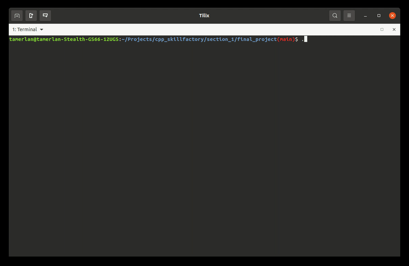

# Консольный чат

Простой консольный чат, написанный на C++17 и  протестированный в ОС Ubuntu 24.04.

### Описание 
Консольный чат обладает следующим базовым функционалом:
- консольная программа;
- регистрация пользователей - логин, пароль;
- вход в чат по логину/паролю;
- отправка сообщений конкретному пользователю;
- обмен сообщениями между всеми пользователями чата одновременно.

Дополнительный функционал чата:
- запоминается и выводится время отправки сообщения;
- все пароли хранятся в хэшированном виде с помощью алгоритма SHA256 (а значит, защищены от взлома);
- в чате есть подсветка сообщений.

### Структура проекта
- _3rd-party_ - папка со сторонними библиотеками (сейчас они все header-only)
- _chat_data_ - папка с сообщениями и аккаунтами пользователей в json-формате
- _media_ - папка, содержащая медиа файлы для данного README
- _*.hpp, *.cpp_ - заголовочные и исходные файлы чата

### Описание пользовательских типов данных
- [ChatClient](chat_client.hpp) - приложение клиента чата
- [ChatServer](chat_server.hpp) - приложение сервера чата
- [IDataManager](data_manager_interface.hpp) - абстрактный базовый класс для управления сохраняемыми данными
- [FileDataManager](file_data_manager.hpp) - реализация класса `IDataManager` для хранения данных в файлах
- [ILogger](logger_interface.hpp.hpp) - абстрактный базовый класс для логирования
- [Logger](logger.hpp) - реализация класса `ILogger` для логирования в файл
- [skillfactory::MsgType](chat_msgs.hpp), [skillfactory::MsgStatus](chat_msgs.hpp), [skillfactory::NetMessage](chat_msgs.hpp) - структуры для коммуникации клиента и сервера
- [TcpServer](tcp_library.hpp), [TcpClient](tcp_library.hpp) - классы базовых TCP сервера и клиента
- [Message](message.hpp) - класс, хранящий информацию об отдельном сообщении
- [DateTime](datetime.hpp), [Date](datetime.hpp), [Time](datetime.hpp) - классы хранящие информацию о дате и времени
- ~~[App](app.hpp) - класс программы чата с интерфейсом (TUI)~~
- ~~[User](user.hpp) - класс, хранящий информацию об отдельном пользователе~~


### Использованные библиотеки
- [termcolor](https://github.com/ikalnytskyi/termcolor/tree/master)
- ~~[nlohmann/json](https://github.com/nlohmann/json)~~
- [PicoSHA2](https://github.com/okdshin/PicoSHA2)

### Компиляция

```bash
make
make clean
```
### Запуск программы

Запуск сервера:  
```bash
./chat_server
```

Для остановки сервера в терминале нужно ввести 'q' и нажать Enter

Запуск клиента:  
```bash
./chat_client
```

### Пример использования

<!-- TODO: обновить гифку -->


### TODO:
- [ ] Улучшить TUI
- [ ] Использовать паттерн MVC для отделения логики от UI
- [ ] Выделить класс пользователя
- [ ] Шифровать сообщения, хранящиеся в файле
- [ ] Вернуть возможность писать всем пользователям
- [ ] Добавить возможность создавать логин с пробелом
- [x] Добавить возможность работы по сети
- [x] Дополнять файлы с пользователями и историей, а не перезаписывать с нуля при добавлении нового элемента
- [x] Заменить кастомную хэш-таблицу на `std::unordered_map`